# Homework Submission

**Họ tên:** Nguyễn Xuân Yến

## Các bài đã hoàn thành
- [x] Bài 1: Statistics APIs
- [x] Bài 2: Batch Create
- [x] Bài 3: Batch Delete
- [x] Bài 4: Concurrent-safe Create
- [x] Bài 5: In-memory Health Check
- [x] Bài 6: Pagination (Bonus)
- [x] Bài 7: Search (Bonus)

## Testing screenshots

#### Bật server 
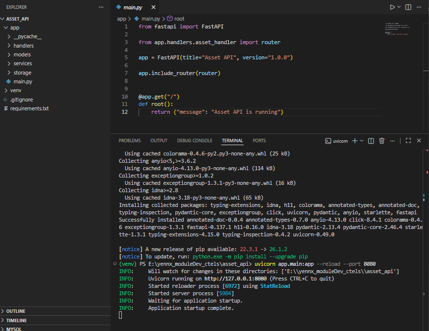 

### Bài 1: Statistics APIs
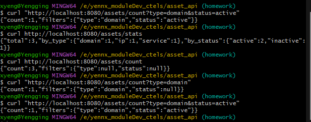

### Bài 2: Batch Create
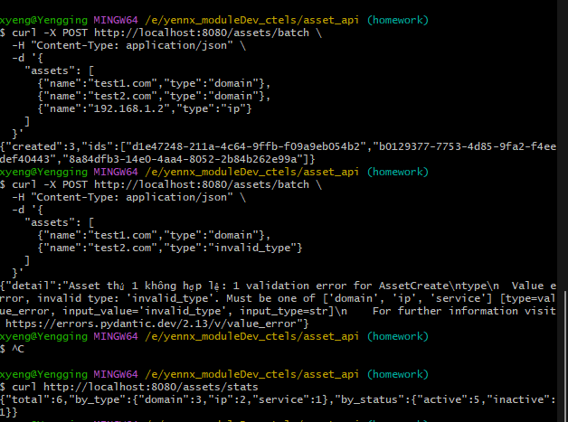

### Bài 3: Batch Delete
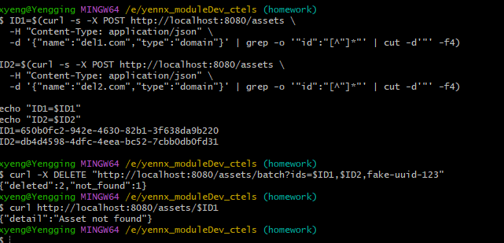

### Bài 4: Concurrent-safe Create
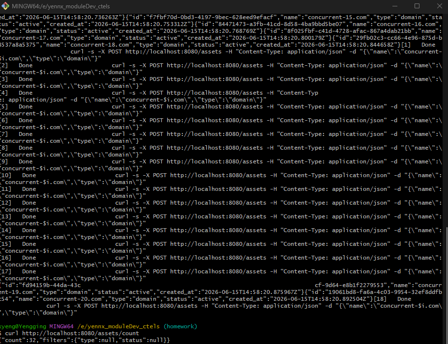

### Bài 5: In-memory Health Check
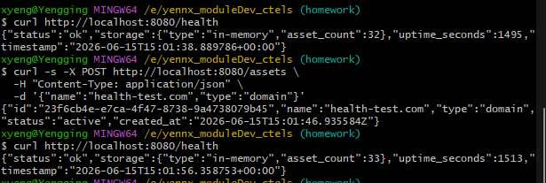

### Bài 6: Pagination & Filtering
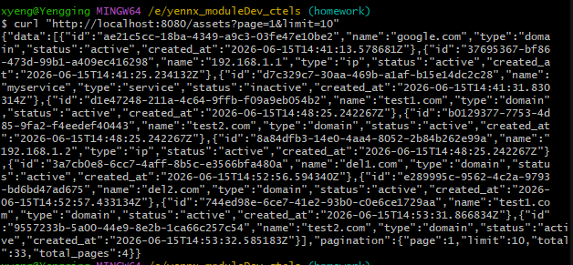
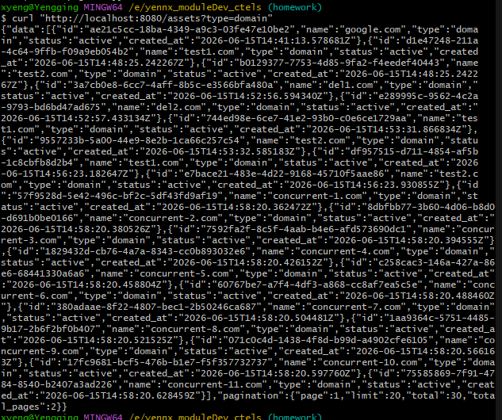
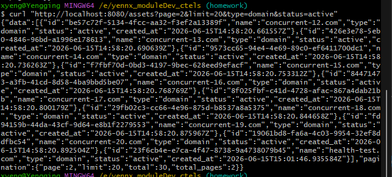

### Bài 7: Search by Name
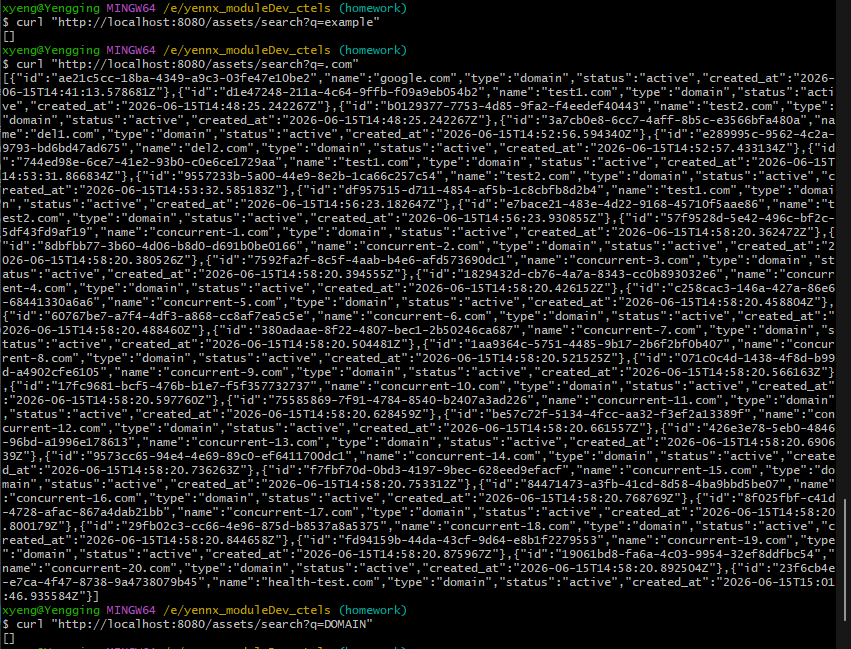
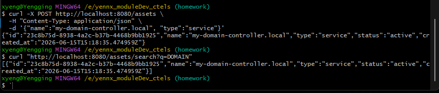